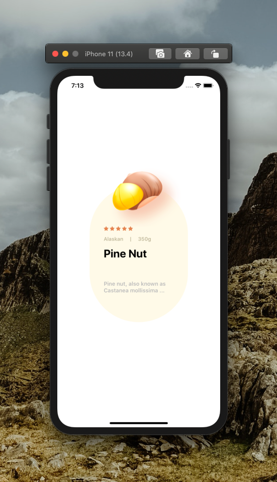
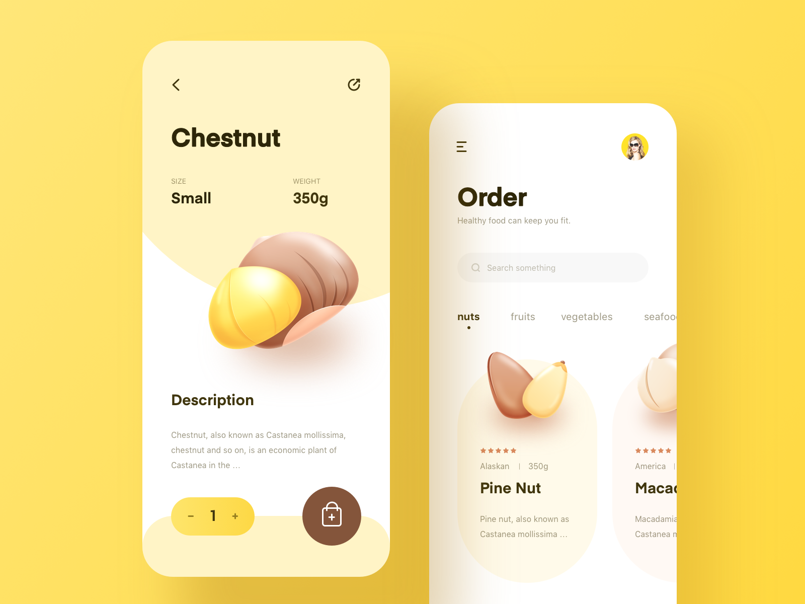

[](https://github.com/WrathChaos/react-native-imaged-card)

[](https://github.com/WrathChaos/react-native-imaged-card)

[](https://www.npmjs.com/package/react-native-imaged-card)
[](https://www.npmjs.com/package/react-native-imaged-card)

[](https://opensource.org/licenses/MIT)
[](https://github.com/prettier/prettier)

<p align="center">
  
</p>

<p align="center">
  <b>Dribbble Inpsiration</b>  
</p>

<p align="center">
  
</p>

# Installation

Add the dependency:

```ruby
npm i react-native-imaged-card
```

## Peer Dependencies

###### IMPORTANT! You need install them

```js
"react": ">= 16.x.x",
"react-native": ">= 0.55.x",
"react-native-vector-icons": ">= 6.6.0",
"react-native-dynamic-vector-icons": ">= 0.1.1"
```

# Usage

## Import

```js
import ImagedCard from "react-native-imaged-card";
```

## Basic Usage

```js
<ImagedCard stars={5} title="Nuts />
```

# Configuration - Props

| Property           |  Type  |                     Default                     | Description                         |
| ------------------ | :----: | :---------------------------------------------: | ----------------------------------- |
| stars              | number |                        5                        | change the rendering of star count  |
| starColor          | color  |                     #e58450                     | change the stars colors             |
| titleText          | string |                    Pine Nut                     | use this to set title's text        |
| descText           | string | Pine nut, also known as Castanea mollissima ... | use this to set description's text  |
| regionText         | string |                     Alaskan                     | use this to set region's text       |
| subregionText      | string |                      350g                       | use this to set subregion's text    |
| backgroundColor    | color  |                     #fffae8                     | change the main background color    |
| dividerStyle       | style  |                     default                     | change the divider's view style     |
| titleTextStyle     | style  |                     default                     | change the title's text style       |
| descTextStyle      | style  |                     default                     | change the description's text style |
| imageSource        | asset  |                    undefined                    | set your own image for the top one  |
| regionTextStyle    | style  |                     default                     | change the region's text style      |
| subregionTextStyle | style  |                     default                     | change the subregion's text style   |

## Future Plans

- [x] ~~LICENSE~~
- [ ] Write an article about the lib on Medium

## Credits

Thank you for this awesome inspiration. Designed by [Enhuy](https://dribbble.com/shots/9195334-nuts-app)

## Author

FreakyCoder, kurayogun@gmail.com

## License

React Native Imaged Card is available under the MIT license. See the LICENSE file for more info.
